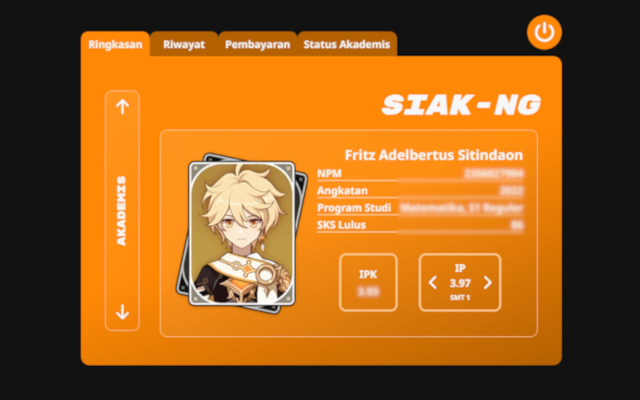
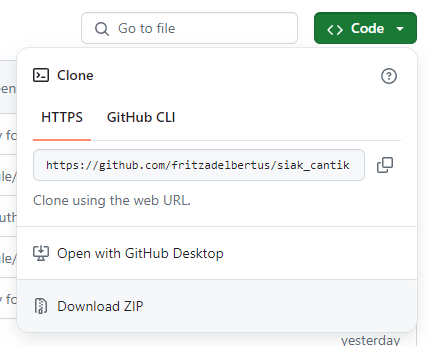
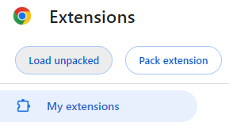
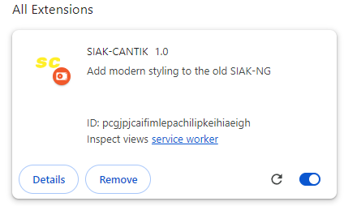
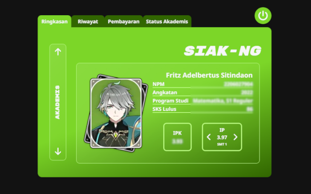
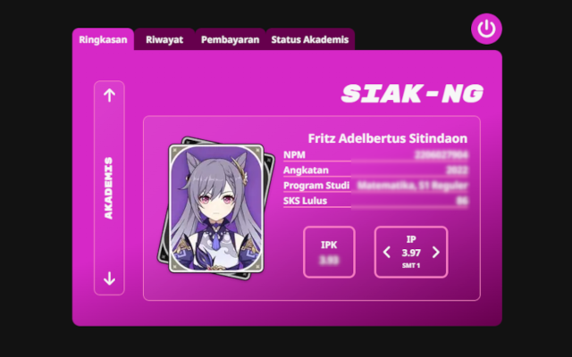
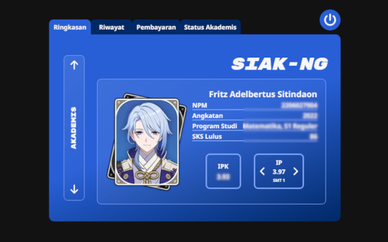
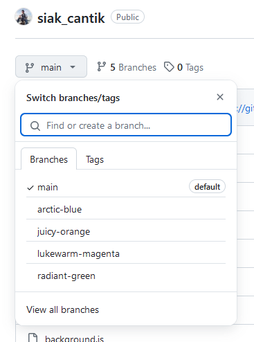

# SIAK-CANTIK

A Chrome Extension Project that injects styling to the [SIAK-NG](https://academic.ui.ac.id/main/Authentication/) website

## Table of contents

- [Overview](#overview)
  - [Screenshot](#screenshot)
  - [Restrictions](#restrictions)
  - [Next Update](#next-update)
- [Installation](#installation)
  - [Chrome Web Store](#chrome-web-store)
  - [Github Repository](#github-repository)
- [Customization](#customization)
  - [Custom Profile Photo](#custom-profile-photo)
  - [Cutom Color Pallete](#custom-color-pallete)
  - [Advanced Customization](#advanced-customization)
- [Author](#author)

## Overview

This project aims to beautify the interface of SIAK-NG

### Screenshot

### Restrictions
Below are the urls that this extension supported
- [Login Page](https://academic.ui.ac.id/main/Authentication/)
- [Ringkasan](https://academic.ui.ac.id/main/Academic/Summary)
- [Riwayat](https://academic.ui.ac.id/main/Academic/HistoryByTerm)
- [Pembayaran](https://academic.ui.ac.id/main/Academic/Payment)
- [Status Akademis](https://academic.ui.ac.id/main/Academic/StatusList)
- [Kalender Akademik](https://academic.ui.ac.id/main/Academic/StatusList)
- [Kalender Akademik](https://academic.ui.ac.id/main/CalendarUI/Index)
- [Jadwal Kuliah](https://academic.ui.ac.id/main/Schedule/Index)
- [Jadwal Kuliah Lengkap](https://academic.ui.ac.id/main/Schedule/IndexOthers)

### Next Update
List of urls pending to support this extension
- [Lihat IRS](https://academic.ui.ac.id/main/CoursePlan/CoursePlanViewSummary)
- [Isi/Ubah IRS](https://academic.ui.ac.id/main/CoursePlan/CoursePlanEdit)
- [Add IRS](https://academic.ui.ac.id/main/CoursePlan/CoursePlanAdd)
- [Drop IRS](https://academic.ui.ac.id/main/CoursePlan/CoursePlanDrop)

## Installation

### Chrome Web Store

### Github Repository

1. Download Zip from this website and extract

   
2. Type [chrome://extensions/](chrome://extensions/) in Google Chrome search bar and press Enter
3. Make sure to turn on 'Developer mode' in the upper right corner

   

4. Click the 'Load unpacked' button

    

5. Find and select the extracted folder from step #1
6. Make sure the extension is on, refresh it, and you are ready to go!

    

## Customization

### Custom Profile Photo
The profile photo in the [Ringkasan](https://academic.ui.ac.id/main/Academic/Summary) can be easily customized

1. Follow the [Github Repository](#github-repository) installation process
2. Prepare a 3x4 profile photo
3. Rename the file into `profile.png`
4. Replace the `profile.png` inside the extraced folder with your file from step #3

### Custom Color Pallete

There are 4 different color palletes for this project, `Juicy-Orange(Default)`, `Radiant-Green`, `Lukewarm-Magenta` and `Arctic-Blue`.
To implement them:
1. Click the `main` dropdown button and select your desired color pallete

    
2. Follow the [Github Repository](#github-repository) installation process

### Advanced Customization
For more customized color palletes and personalized features, the author suggest the user to tinker with the source code (assuming the user have basic knowledge on HTML, CSS, JavaScript, and npm). The user can start with modifying the `style-config.scss` inside the `styles` folder.

## Author

- Fritz Adelbertus Sitindaon 
