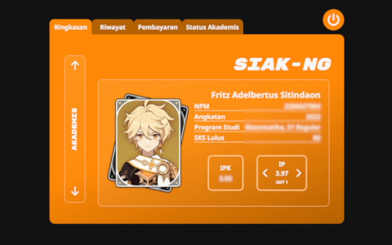
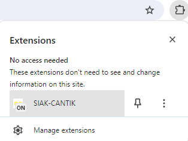
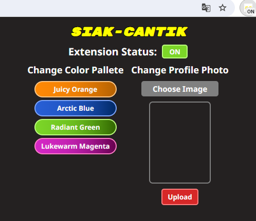

# SIAK-CANTIK

A Chrome Extension Project that injects styling to the [SIAK-NG](https://academic.ui.ac.id/main/Authentication/) website

## Table of contents

- [Overview](#overview)
  - [Screenshot](#screenshot)
  - [Restrictions](#restrictions)
  - [Next Update](#next-update)
- [Installation](#installation)
  - [Chrome Web Store](#chrome-web-store)
- [Customization](#customization)
  - [Advanced Customization](#advanced-customization)
- [Author](#author)

## Overview

This project aims to beautify the interface of SIAK-NG

### Screenshot

### Restrictions
Below are the urls that this extension supported
- [Login Page](https://academic.ui.ac.id/main/Authentication/)
- [Ringkasan](https://academic.ui.ac.id/main/Academic/Summary)
- [Riwayat](https://academic.ui.ac.id/main/Academic/HistoryByTerm)
- [Pembayaran](https://academic.ui.ac.id/main/Academic/Payment)
- [Status Akademis](https://academic.ui.ac.id/main/Academic/StatusList)
- [Kalender Akademik](https://academic.ui.ac.id/main/CalendarUI/Index)
- [Jadwal Kuliah](https://academic.ui.ac.id/main/Schedule/Index)
- [Jadwal Kuliah Lengkap](https://academic.ui.ac.id/main/Schedule/IndexOthers)

### Next Update
List of urls pending to support this extension
- [Lihat IRS](https://academic.ui.ac.id/main/CoursePlan/CoursePlanViewSummary)
- [Isi/Ubah IRS](https://academic.ui.ac.id/main/CoursePlan/CoursePlanEdit)
- [Add IRS](https://academic.ui.ac.id/main/CoursePlan/CoursePlanAdd)
- [Drop IRS](https://academic.ui.ac.id/main/CoursePlan/CoursePlanDrop)

List of pending features
- SIAK-WAR helper

## Installation

### Chrome Web Store

This project is available to install in the Chrome Web Store. You can visit this product by clicking [this link](https://chromewebstore.google.com/detail/siak-cantik/ddgjglpedngdiclljopcmmpjdhnnjgkp?authuser=0&hl=en)

## Customization

Custom color pallete, and profile photo is available in the popup screen accessed by clicking the extension.

  

Currently there are 4 themes and you can upload a custom profile photo

  

### Advanced Customization
For more customized color palletes and personalized features, the author suggest the user to tinker with the source code (assuming the user have basic knowledge on HTML, CSS, JavaScript).

## Author

- Fritz Adelbertus Sitindaon 
